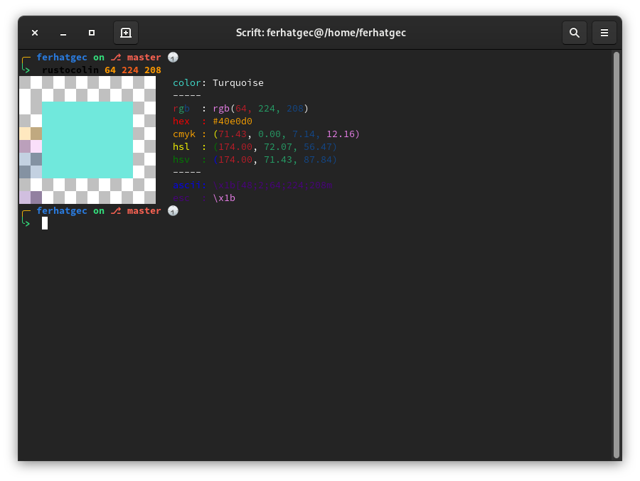

# RustoColin
## RustoColin, Rust implementation of Colin.

### Other implementations:
 * [Colin](https://github.com/ferhatgec/colin)
 * [PyColin](https://github.com/ferhatgec/pycolin)

### RustoColin licensed under the terms of MIT License.
